# Why This Matters {#sec-why}

Rivers are the main source of drinking water, food, and energy for more than two billion people. In South Africa, decades of mining around Johannesburg, heavy farming in the interior, and ageing water pipes have left **four out of every ten rivers** in poor or failing health. The country only has 162 official water-testing sites spread across a landmass the size of Western Europe, meaning most rivers go unchecked for months at a time.

The goal of this project is to find out whether free satellite images and weather data can do what expensive field visits cannot — catch river problems early, from a distance, before they get worse.

> *"Can we accurately forecast river water quality parameters in South Africa using publicly available satellite and climate datasets?"*

::: {layout-ncol=2}
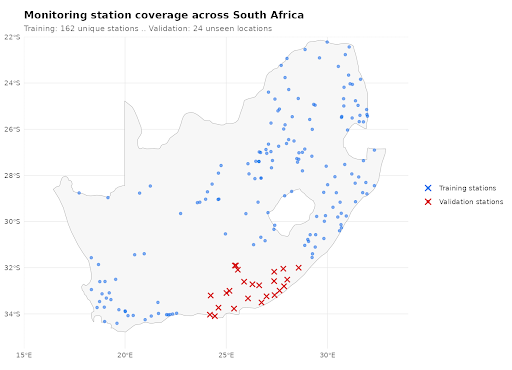

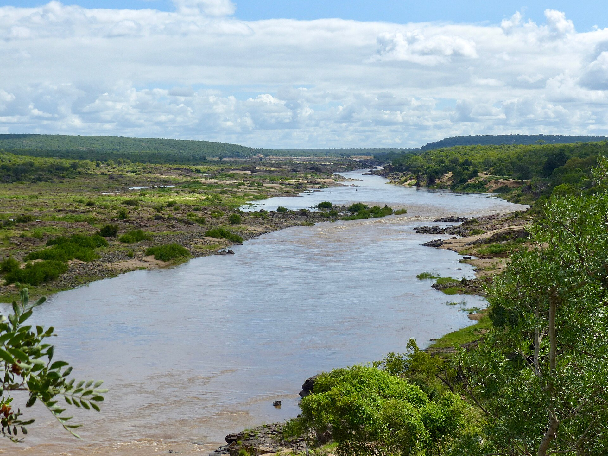
:::

# What's Been Done Before, and Where We Fit

Our project builds on three streams of prior work. Huizenga et al. (2013) provide a national baseline for South African river chemistry from 1972–2011, giving us historical context for alkalinity, conductance, and nutrient conditions before our satellite-era analysis. Dabrowski and de Klerk (2013) focus on the Olifants River system and show how land use, mining, agriculture, and urban activity can affect river-water quality within a single watershed. Olmanson et al. (2011) demonstrate that remote sensing can connect satellite-derived spectral indices with water-quality patterns, showing why Landsat imagery is useful for environmental monitoring.

Together, these studies motivate our approach but also reveal the gap we fill. Prior work either focuses on historical chemistry, a single South African watershed, or remote sensing in a different setting. Our project combines station-level South African water chemistry with Landsat, climate, geography, and land-use variables at a broader national scale.

# The Data We Used

Our analysis uses a combination of three datasets that are public in order to study the water quality across South Africa during the years 2011 through 2015. The first dataset by the Department of Water and Sanitation of South Africa contained 9,319 field measurements that were collected by 162 monitoring stations. The dataset contains three major indicators of river chemistry, which are Total Alkalinity, Dissolved Reactive Phosphorus, and Electrical Conductance. We did see missing observations of Dissolved Reactive Phosphorus from certain stations, but they were filled with median values. 

To measure different environmental conditions specifically around the river stations, we decided to use the Landsat 8 Satellite Imagery dataset. This dataset included 190 satellite scenes which contained 30 meter spatial resolution. The dataset also had a revisit cycle of 16 days. Unfortunately, cloud coverage was a major challenge, we noticed around 22 percent of the scenes contained in the dataset were covered by clouds. We also noticed around 35 percent of the scenes were unusable because of rainy conditions.

The last dataset we included was the Terra Climate. This dataset was important in order to analyze the climate information like temperature, precipitation, and evapotranspiration in South Africa.

## Variable Reference Table

The analysis combines three public datasets covering 2011–2015: field measurements from the South African Department of Water and Sanitation (DWS), Landsat 8 satellite imagery, and TerraClimate climate data. The table below summarizes every variable used in the modeling pipeline.

# What We Found

## SQ1 · Which Landsat spectral indices correlate most strongly with alkalinity, conductance, and phosphorus?

*The satellite tells us about salts, not phosphorus*

To evaluate whether satellite imagery could help explain river water quality, we matched field measurements of river chemistry to Landsat-derived spectral features at the same monitoring locations and sample dates. We focused on total alkalinity, electrical conductance, and dissolved reactive phosphorus, which represent different types of degradation. Alkalinity and conductance are linked to dissolved minerals and salts, while phosphorus is more closely tied to runoff, agriculture, and land-use processes.

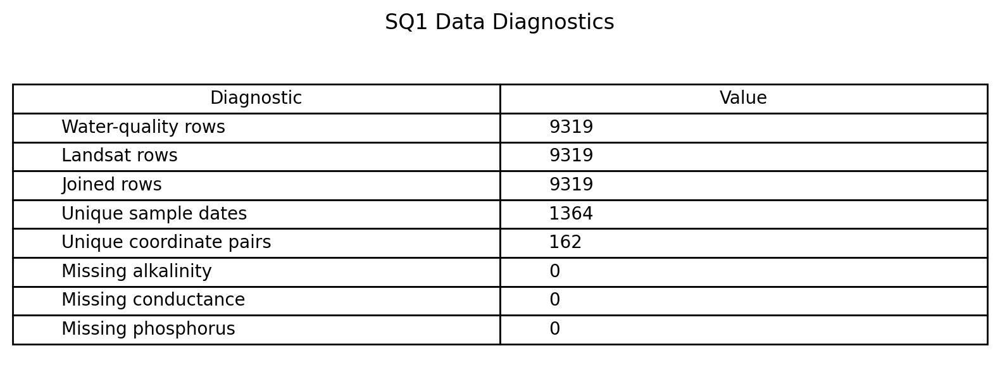

Using 8,234 complete station-scene pairs across 162 monitoring locations, we tested six Landsat features: green, NIR, SWIR16, SWIR22, NDMI, and MNDWI.

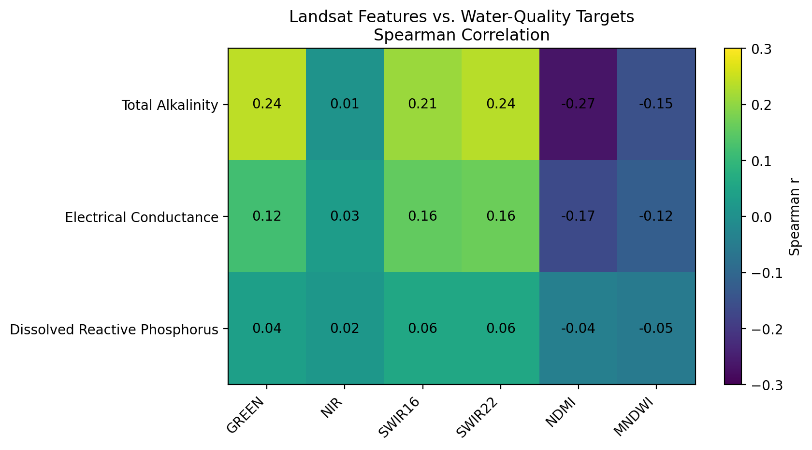

The main finding is that Landsat is more informative for ionic pollution than for phosphorus. NDMI had the strongest relationship with total alkalinity, with Spearman r = -0.266, and electrical conductance, with r = -0.165. These modest correlations suggest Landsat is not measuring chemistry directly, but it captures environmental conditions related to dissolved minerals.

Phosphorus behaved differently. Its strongest correlation was only about 0.058, meaning it is nearly invisible from Landsat reflectance alone. Future work should combine Landsat with rainfall, runoff, land use, and watershed variables.

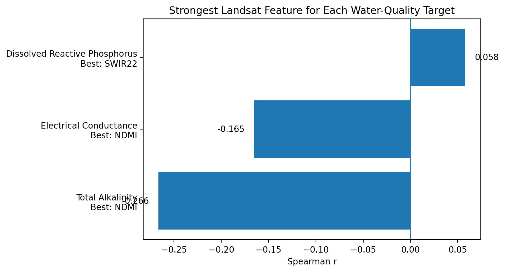

## SQ2 · How do climate variables track seasonally with water quality over time? 

*Climate controls when rivers degrade*

South Africa has two very different seasons and they push rivers in opposite directions. In the dry winter months (June to August) there is almost no rain, so rivers shrink and whatever salt and minerals are in the water become more concentrated — the same way soup gets saltier as it boils down. In the rainy summer months (November to February) the opposite happens: rainfall washes fertiliser off farm fields straight into rivers.

This means the season alone is a strong early warning signal. **Winter means rising salt levels. Summer means rising phosphorus.** The two charts below show this pattern repeating consistently across all five years of data collected from 162 stations across the country.

::: {layout-ncol=2}

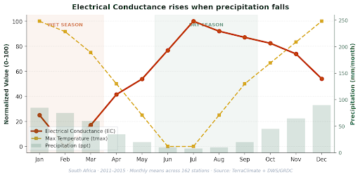

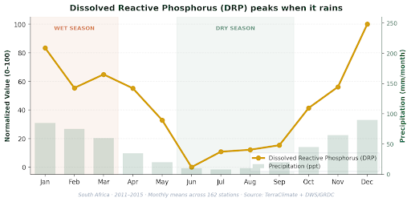

:::

## SQ3 · Which ML models predict water quality best at unseen river sites?

*Random Forest is the right tool for unseen sites*

Since we are talking about prediction, we were wondering which of three machine learning models, linear regression, Random Forest, and XGBoost, predicts water quality most accurately at South African river sites the model has not seen during training. To answer this we used spatial cross validation, where folds are split by site rather than by row, so test rivers are genuinely unseen. Each model was trained on three water quality targets: total alkalinity, electrical conductance, and dissolved reactive phosphorus. Random Forest came out on top across all three. It hit a mean $R^2$ of about 0.30 on alkalinity and 0.27 on electrical conductance, and 0.15 on phosphorus. Linear regression sat well behind on every target, and its near zero $R^2$ on phosphorus told me that the signal there is non linear rather than missing entirely. XGBoost was competitive on average but unstable, including one fold where it crashed to an $R^2$ of -0.65 on alkalinity. The takeaway is that Random Forest is the right model for this kind of spatial generalization, not because it scores highest on its best day, but because it never collapses the way XGBoost can when an unseen fold contains rivers it does not recognize.

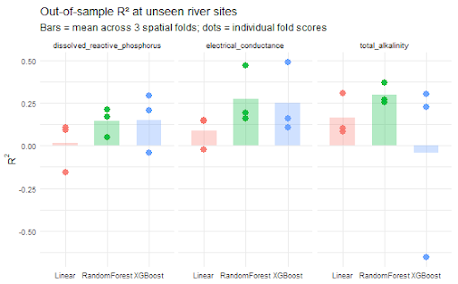

## SQ4 · Are there geographic clusters of degradation, and do regional models predict better than one national model?

*Region matters more than method*

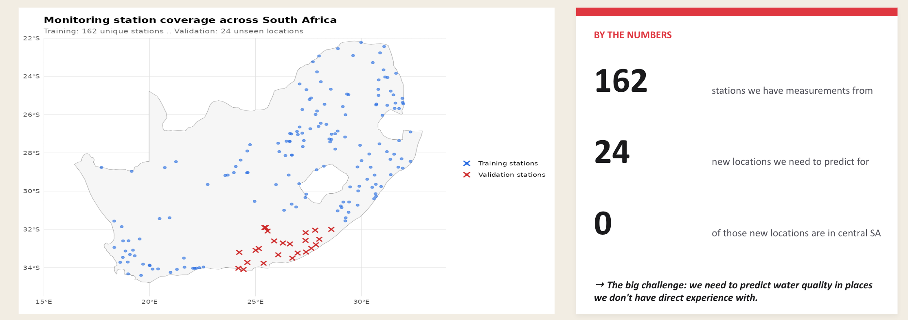

Our analysis draws on 162 monitoring stations across South Africa, with measurements collected between 2011 and 2015. The forecasting task targets 24 new validation locations, all clustered along the south coast, none in the central interior. This geographic mismatch is the central challenge: we need to predict water quality in places where we have little direct data, using patterns learned from stations elsewhere.

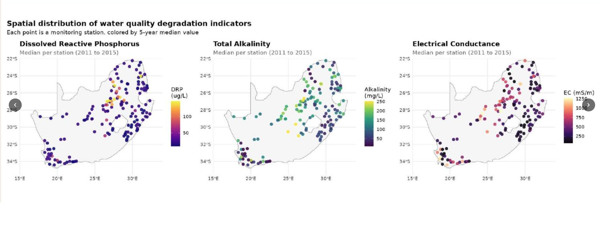

To detect regional patterns, we combined the three water-quality indicators, including Total Alkalinity, Electrical Conductance, and Dissolved Reactive Phosphorus, into a single composite degradation score per station. Each indicator measures pollution on a different scale and captures a different type of contamination, so a station moderately polluted across all three can still look fine when each one is examined on its own. A combined score captures the full picture and shows whether the most degraded stations group together on the map.

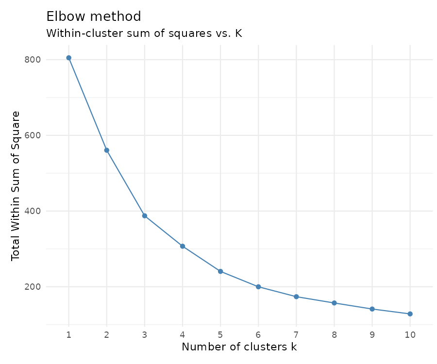

The elbow method identified k = 4 as the optimal number of clusters. Fewer would lump the central pollution hotspot in with cleaner stations and hide the pattern; more would fragment the data into samples too small to learn from reliably. The four regions are sharply different. Region A along the east coast is the cleanest, sitting 0.46 standard deviations below the national average. Region D in the central interior, which overlaps the Highveld, with its gold and coal mining around Johannesburg plus heavy agriculture, sits 0.91 standard deviations above the national average, making it the country's clearest pollution hotspot.

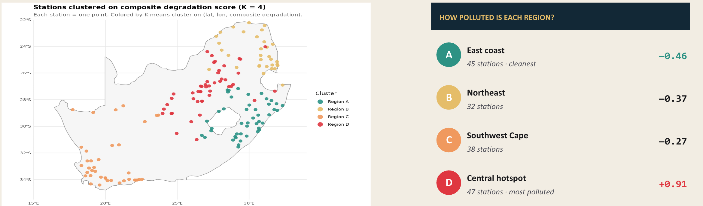

We then trained five Random Forest models on the 162-station training set: one general model and four region-specific models, each trained only on stations within its cluster. The general model explained just 7% of the station-to-station variation (R² = 0.07). The four regional models, taken together, explained 50% (R² = 0.50) — roughly a sevenfold improvement.

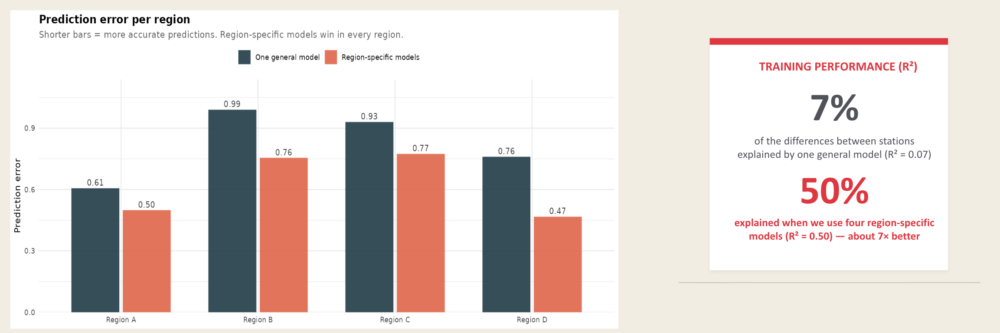

Taken together, the results confirm two things. Geographic clusters of water-quality degradation do exist across South African rivers, and training separate regional models meaningfully improves prediction accuracy at unseen locations.

## SQ5 · Do land-use characteristics surrounding each station improve DRP prediction?

*Land use doesn't rescue phosphorus prediction*

One of the interesting and surprising findings was that land use indicators from the Landsat 8 Satellite Imagery demonstrated basically no relationship or correlation with Dissolved Reactive Phosphorus levels in the rivers of South Africa. The Landsat 8 Satellite Imagery datasets contained measurements of vegetation density and urban development which we used to test whether or not the surrounding land use conditions correlated with the Dissolved Reactive Phosphorus. 

After executing the tests, the results were consistently weak. All the tested correlations between Dissolved Reactive Phosphorus and land use variables remained very small. We used indicators such as NDMI which was related to vegetation land use and it presented a slight negative correlation with the Dissolved Reactive Phosphorus. We used the SWIR16 and SWIR22 indicators for urban land use, in those cases we did see a positive correlation, but it was very minimal. After seeing the results of these tests, they were not reliable enough to support the phosphorus prediction.

These results are actually significant because our question one demonstrated that phosphorus was challenging to detect spectrally in comparison to alkalinity and electrical conductance. Our land use question reinforces the conclusion from question one because we are able to determine that the broader land use indicators fail to provide a reliable and strong predictive phosphorus contamination result. The findings indicate a more nuanced answer to our overarching question which is that Landsat 8 Satellite Imagery data can be used to explain a couple of forms of river degradation, but Dissolved Reactive Phosphorus remains a less reliable predictor.

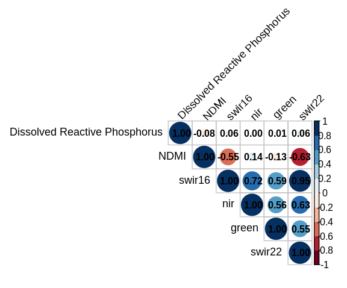

# Putting It Together: Answering the OQ {#sec-integration}

Our five questions point to a single, layered answer: river water quality in South Africa is best predicted by combining region, season, and pollutant type, with no single factor sufficient on its own.

Region is the strongest pattern. Spatial clustering (SQ4) splits the country into four regions and train a separate model lifts explained variance from 7% to 50% - a sevenfold improvement.

Climate controls timing. SQ2 showed that climate variables do not predict which rivers are degraded, but predict when. Precipitation tracks Electrical Conductance at r = −0.67 (2-month lag): dry months shrink rivers and concentrate salts. Phosphorus follows the opposite rhythm — precipitation correlates positively with DRP (r = +0.61, same month) because rainfall flushes phosphorus from soils into rivers rather than diluting it.

Satellite signal fits salts, not phosphorus. SQ1 found that Landsat's NDMI and SWIR bands carry a real signal for dissolved salts (r = −0.266 for NDMI vs. alkalinity), but DRP is essentially spectrally invisible (max |r| = 0.058 across six indices). SQ5 confirmed this from a different angle: land-use proxies around each station also failed to predict phosphorus, with all correlations |r| < 0.07. Salts can be read from Landsat reflectance, phosphorus cannot.

### Bottom line:

Water-quality degradation is best explained by region, season, and pollutant type. Remote sensing is useful, but strongest for salt-related pollution and weakest for phosphorus.

To sum up, we can forecast river water quality in South Africa from the public satellite and climate data, but only when models are trained regionally rather than  nationally.

# What We Couldn't Do, and What's Next

## Limitations

The biggest limitation is that all 200 held-out observations (24 stations) are from the south coast (SQ4). That means the Random Forest result is only a statement about how the model generalizes within that geographic slice. We cannot say from these results how it would hold up in Region D, the central hotspot where pollution is highest but training stations are sparsest. 

The cloud cover problem also matters more than the 12% missing rate suggests. The rainy season loses about 35% of Landsat scenes (SQ1) and that is exactly when DRP spikes (SQ2), so the satellite is least informative right when the water quality signal is strongest. That probably explains some of why phosphorus was the hardest target for every model that was tested. The climate inputs are also thin since only PET was provided. 

## Next steps

Next steps would be pulling in precipitation, tmax, tmin, and runoff from the same TerraClimate source, training one model per pollutant per region instead of one national, and adding validation sites outside the south coast so we can check whether the approach generalizes countrywide.

