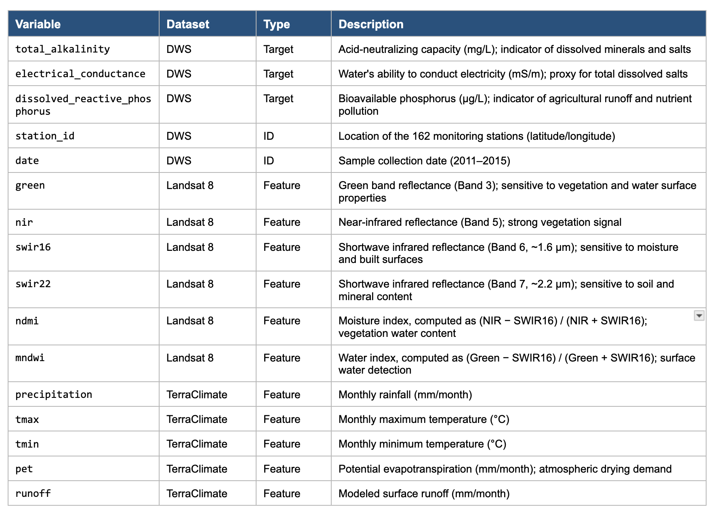
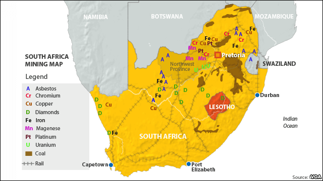

```{r}
#| label: setup
#| include: false
#| code-summary: "Load packages and set seed"
library(tidyverse)
library(sf)
library(rnaturalearth)
library(patchwork)
library(gt)
library(randomForest)

set.seed(20260507)   # date of final presentation

# Theme defaults applied to every plot in the document.
theme_set(theme_minimal(base_size = 11) +
          theme(plot.title    = element_text(face = "bold"),
                plot.subtitle = element_text(color = "grey30"),
                panel.grid.minor = element_blank()))
```


{#fig-provinces fig-alt="Map of South Africa showing its nine provinces" width=70% fig-align="center"}

*Source: (https://www.mappr.co/counties/south-africa/).*


# Project motivation

Water quality in South Africa is a compelling project from two angles. On the analytical side, it offers a chance to understand which factors most strongly influence river water quality and how the current data sources track those conditions. On the practical side, it tests whether machine learning models can predict water quality from satellite and climate data well enough to let regulators extend monitoring coverage to remote rivers without sending field crews — a meaningful operational gain in a country where physical water sampling is expensive and slow. With these two angles in mind, Team Waterbenders set out to answer the following overarching question:

**Overarching Question.** Can we accurately forecast river water quality parameters in South Africa using publicly available satellite and climate datasets?

In this report, I focus on the regional aspect of the problem:

**SQ4 — Geographic Clustering.** Are there distinct geographic clusters of water quality degradation in South African rivers, and does training separate regional models improve prediction accuracy on unseen locations?

SQ4 is one of the most important findings of the project. If water chemistry across South Africa is roughly the same everywhere, then a single national model trained on the 162 training stations should work fine for the 24 unseen validation stations, and the other team members' findings can be used as they are. But if the country contains distinct regions with different patterns, a national model produces an average that fits no single region well — which means every other finding from the project would need to be applied regionally rather than nationally to be useful.

# Data Acquisition

## Data source

This analysis uses four CSV files distributed through the EY AI & Data Challenge 2026 on Snowflake [@eychallenge2026].

**Water Quality Training Dataset**

The training file contains 9,319 station-date observations collected by the South African Department of Water and Sanitation (DWS) and the Global Runoff Data Centre (GRDC), spanning January 2011 through December 2015. Each row carries six fields: latitude, longitude, sample date, and the three target measurements — Total Alkalinity (TA), Electrical Conductance (EC), and Dissolved Reactive Phosphorus (DRP).

These are wet-chemistry measurements, not satellite-derived values. A field technician visits each station, fills a sealed bottle, and transports it to an accredited lab. The cost of producing each row is high, which is why a 162-station national network is considered "sparse" coverage and why a satellite-based forecasting system would be valuable.


```{r}
#| label: Water quality
#| code-summary: "Water quality training dataset"

# EY Challenge files use dd-mm-yyyy date format, not ISO. Parse explicitly.
parse_dmy <- function(x) as.Date(x, format = "%d-%m-%Y")

# Water quality (the three targets)
wq <- read_csv("data/water_quality_training_dataset.csv",
               show_col_types = FALSE) |>
  rename(lat  = Latitude, lon = Longitude, date = `Sample Date`,
         TA   = `Total Alkalinity`,
         EC   = `Electrical Conductance`,
         DRP  = `Dissolved Reactive Phosphorus`) |>
  mutate(date       = parse_dmy(date),
         # No station_id column in the file; reconstruct from rounded coords.
         station_id = paste(round(lat, 4), round(lon, 4), sep = "_"))

glimpse(wq)
```
**Landsat 8 Spectral Features**

The two Landsat files (`landsat_features_training.csv`, `landsat_features_validation.csv`) provide six surface-reflectance variables matched to each water-quality sample date: four raw bands (Green, NIR, SWIR16, SWIR22) plus two derived indices:

$$
\text{NDMI} = \frac{\text{NIR} - \text{SWIR16}}{\text{NIR} + \text{SWIR16}}, \qquad
\text{MNDWI} = \frac{\text{Green} - \text{SWIR16}}{\text{Green} + \text{SWIR16}}
$$


```{r}
#| label: landsat dataset - train
#| code-summary: "Landsat training dataset"
# Landsat spectral features (training)

ls_tr <- read_csv("data/landsat_features_training.csv",
                          show_col_types = FALSE) |>
  rename(lat = Latitude, lon = Longitude, date = `Sample Date`) |>
  mutate(date = parse_dmy(date))

glimpse(ls_tr)
```

```{r}
#| label: landsat dataset - validation
#| code-summary: "Landsat validation dataset"
# Landsat spectral features (validation)

ls_va <- read_csv("data/landsat_features_validation.csv",
                        show_col_types = FALSE) |>
  rename(lat = Latitude, lon = Longitude, date = `Sample Date`) |>
  mutate(date = parse_dmy(date))

glimpse(ls_va)
```
**TerraClimate Climate Features**

The TerraClimate file provides a single climate variable — potential evapotranspiration (`pet`) — for each station-date observation, drawn from the UC Merced Climatology Lab's monthly gridded climate product [@abatzoglou2018]. Unlike Landsat, TerraClimate is not a direct observation; it is a modeled product, assembled by combining WorldClim long-term climate normals with CRU Ts4.0 time-varying anomalies, then running a physical water balance model. The result is a global ~4 km monthly grid. 

```{r}
#| label: Terraclimate dataframe
#| code-summary: "Terraclimate training dataset"
# TerraClimate (PET only in the EY release)
tc <- read_csv("data/terraclimate_features_training.csv",
                         show_col_types = FALSE) |>
  rename(lat = Latitude, lon = Longitude, date = `Sample Date`) |>
  mutate(date = parse_dmy(date))

glimpse(tc)
```

**Submission Template**

A fourth file (`submission_template.csv`) defines the prediction target: 200 station-date rows across 24 unique stations, with empty target columns to be filled by the model.

```{r}
#| label: Submission dataframe
#| code-summary: "Submission or validation dataset"
# Submission template (defines the 24 unseen validation stations)
sub <- read_csv("data/submission_template.csv",
                       show_col_types = FALSE) |>
  rename(lat = Latitude, lon = Longitude, date = `Sample Date`) |>
  mutate(date       = parse_dmy(date),
         station_id = paste(round(lat, 4), round(lon, 4), sep = "_"))

glimpse(sub)
```

## Variable Reference Table



## Data quality

```{r}
#| label: data-quality
#| code-summary: "Check missingness across all four files"
data_check <- tibble::tibble(
  Dataset = c("Water quality", "Landsat (train)", "Landsat (validation)",
              "TerraClimate"),
  Rows = c(nrow(wq), nrow(ls_tr), nrow(ls_va),
           nrow(tc)),
  `Missing rows` = c(
    sum(is.na(wq$TA) | is.na(wq$EC) | is.na(wq$DRP)),
    sum(is.na(ls_tr$nir)),
    sum(is.na(ls_va$nir)),
    sum(is.na(tc$pet))
  ),
  `% missing` = sprintf("%.1f%%", 100 * `Missing rows` / Rows)
)

data_check |>
  gt() |>
  tab_header(title = "Recording quality check",
             subtitle = "Missingness by file") |>
  fmt_number(columns = c("Rows", "Missing rows"), sep_mark = ",", decimals = 0) |>
  tab_style(
    style = cell_text(weight = "bold"),
    locations = cells_column_labels()
  )
```


There are three data issues that require attention.


**No station identifier.** The water-quality CSV does not include a station ID column. I combine latitude and longitude to four decimal places, then concatenate them into 162 unique IDs (stations) across 9,319 observations.

**Landsat cloud-cover missingness.** 1,085 of 9,319 training rows (11.6%) and 19 of 200 validation rows (9.5%) have all six Landsat fields `NA` because no cloud-free scene was available.

**Outlier values.** A small number of stations show extreme TA, EC, and DRP values.

```{r}
#| label: outlier
#| code-summary: "Check outliners across all 3 water quality factors"

wq |>
  pivot_longer(c(TA, EC, DRP), names_to = "Target", values_to = "Value") |>
  ggplot(aes(Target, Value, fill = Target)) +
  geom_boxplot(outlier.color = "red", outlier.size = 1.5, alpha = 0.7) +
  facet_wrap(~ Target, scales = "free") +
  scale_fill_manual(values = c(TA = "#1f77b4", EC = "#ff7f0e", DRP = "#2ca25f")) +
  labs(title = "Distribution of the three water-quality targets",
       subtitle = "Red points exceed 1.5 × IQR — candidate outliers",
       y = "Value (raw units)", x = NULL) +
  theme(legend.position = "none")
```
## Sampling Quality

The 162 monitoring stations are not a representative sample of South African rivers because the DWS network does not cover all regions of the country evenly. The 24 validation stations are not a random sample either, as they all cluster in a south-coast band where the training set has little coverage. This is visible in @fig-station-coverage below.


## Data preparation

The training data is built by joining the water-quality dataset (the targets TA, EC, and DRP) with the Landsat features (six spectral variables) and TerraClimate's PET, matched by station coordinates and sample date. The model target is the composite degradation score.


```{r}
#| label: dropna
#| code-summary: "Drop missing data"

n_before <- nrow(wq)

wq    <- wq    |> drop_na()
ls_tr <- ls_tr |> drop_na()
tc    <- tc    |> drop_na()

cat(sprintf("Water quality:  %d → %d rows\n",  n_before, nrow(wq)))
cat(sprintf("Landsat (train): %d → %d rows (%.1f%% dropped due to cloud cover)\n",
            n_before, nrow(ls_tr),
            100 * (n_before - nrow(ls_tr)) / n_before))
cat(sprintf("TerraClimate:    %d → %d rows\n", n_before, nrow(tc)))
```

```{r}
#| label: create train and validation dataset
#| code-summary: "Combine datasets for train and validation set"

# --- Merge the three training files on shared keys ---
# inner_join keeps only rows that match in BOTH tables, which automatically
# excludes any cloud-affected (Landsat-missing) rows.
train <- wq |>
  inner_join(ls_tr |> select(lat, lon, date,
                              nir, green, swir16, swir22, NDMI, MNDWI),
             by = c("lat", "lon", "date")) |>
  inner_join(tc |> select(lat, lon, date, pet),
             by = c("lat", "lon", "date")) |>
  mutate(Sample_Date = date,
         Year        = as.integer(format(date, "%Y")),
         Month       = as.integer(format(date, "%m")))

# --- Build validation set (200 unseen rows) ---
# left_join here because we want to keep all 200 submission rows even if
# Landsat is missing — those NAs are predictions waiting to be filled.
val <- sub |>
  left_join(ls_va, by = c("lat", "lon", "date")) |>
  mutate(Sample_Date = date,
         Month       = as.integer(format(date, "%m")))
```

```{r}
#| label: load-south-africa-boundary
#| code-summary: "Load South Africa country boundary for map"
# --- South Africa country boundary (for maps) ---
data("countries50", package = "rnaturalearthdata")
za <- st_as_sf(countries50) |>
  filter(name == "South Africa") |>
  st_transform(4326)
```

**A composite degradation score **

Each station has three water-quality measurements (TA, EC, DRP), each capturing a different aspect of degradation. Clustering on each target separately would produce three different regions, which are useful for asking single-pollutant questions, but not directly for SQ4, which asks where overall water-quality degradation concentrates. I therefore combine the three into a single composite score per station.

Since raw pollutant values are heavily right-skewed, I apply log1p() to compress extreme values without erasing them. The log-transformed pollutants still have different units, so I standardize them into z-scores, putting all three on the same scale despite their different raw units. Last, I average the three z-scores with equal weights because there is no clear basis to favor one factor over another.


```{r}
#| label: build-composite-and-station-summary
#| code-summary: "Build composite degradation score and aggregate to station-level summary"
# --- Build composite degradation score per observation ---
# 3 steps: log(1+x) -> z-score -> average the 3 pollutants
train <- train |>
  mutate(z_alk       = as.numeric(scale(log1p(TA))),
         z_ec        = as.numeric(scale(log1p(EC))),
         z_drp       = as.numeric(scale(log1p(DRP))),
         degradation_score = (z_alk + z_ec + z_drp) / 3)

# --- Aggregate to one row per station with median pollutant values ---
station_summary <- train |>
  group_by(lat, lon) |>
  summarise(TA       = median(TA,              na.rm = TRUE),
            EC       = median(EC,        na.rm = TRUE),
            DRP      = median(DRP, na.rm = TRUE),
            degradation_score                     = mean(degradation_score,                       na.rm = TRUE),
            n_samples                       = n(),
            .groups                         = "drop") |>
  drop_na()

glimpse(station_summary)
```


# Exploratory Data Analysis

## Geographic distribution of monitoring stations

```{r}
#| label: fig-station-coverage
#| fig-cap: "Monitoring station coverage across South Africa. Training stations (blue circles, n=162), Validation stations (red crosses, n=24) sit entirely on the south coast."
#| fig-width: 7
#| fig-height: 6

# Build a combined data frame with one row per unique station,
# tagged as either "Training" or "Validation"
station_locations <- bind_rows(
  train |>
    distinct(lat, lon) |>
    mutate(Set = "Training"),
  val |>
    distinct(lat, lon) |>
    mutate(Set = "Validation")
)

ggplot() +
  geom_sf(data = za, fill = "grey97", color = "grey60") +
  geom_point(data = station_locations,
             aes(x = lon, y = lat,
                 color = Set, shape = Set),
             size = 2.2, alpha = 0.9, stroke = 1.1) +
  scale_color_manual(values = c("Training"   = "#1f77b4",
                                "Validation" = "#d62728"),
                     name = NULL) +
  scale_shape_manual(values = c("Training"   = 16,   # filled circle
                                "Validation" = 4),   # cross
                     name = NULL) +
  coord_sf(xlim = c(15, 33), ylim = c(-35, -22), expand = FALSE) +
  labs(title    = "Monitoring station coverage across South Africa",
       subtitle = "Training: 162 stations. Validation: 24 unseen stations",
       x = NULL, y = NULL) +
  theme_minimal(base_size = 11) +
  theme(legend.position    = "bottom",
        legend.text        = element_text(size = 11),
        plot.title         = element_text(face = "bold", size = 13),
        plot.subtitle      = element_text(color = "grey40"),
        panel.grid.major   = element_line(color = "grey92", linewidth = 0.2),
        panel.grid.minor   = element_blank())
```


The training dataset are distributed nationwide but sparsest in the central interior while the validation dataset sit entirely along the south coast. This map raises a structural question: if South Africa rivers behave differently from one region to the next, a national model fit on all 162 training stations might not help explain what is happening in the validation sites. The following analysis will test whether regional differences are real.

## How the three pollutants vary across the country

```{r}
#| label: fig-three-target-maps
#| fig-cap: "Spatial distribution of water-quality degradation indicators. Each point is a monitoring station, colored by its 2011–2015 station-median value."
#| fig-width: 13
#| fig-height: 5.5

# Helper: one map panel per target with its own palette and color scale.
plot_map <- function(var, title, unit_label, palette) {
  ggplot() +
    geom_sf(data = za, fill = "grey97", color = "grey60") +
    geom_point(data = station_summary,
               aes(x = lon, y = lat,
                   color = .data[[var]]),
               size = 1.8, alpha = 0.9) +
    scale_color_viridis_c(
      option = palette,
      name   = unit_label,
      guide  = guide_colorbar(barwidth        = 0.5,
                              barheight       = 7,
                              title.position  = "top")
    ) +
    coord_sf(xlim = c(15, 33), ylim = c(-35, -22), expand = FALSE) +
    labs(title    = title,
         subtitle = "Median per station (2011 – 2015)",
         x = NULL, y = NULL) +
    theme_minimal(base_size = 10) +
    theme(plot.title       = element_text(face = "bold", size = 12),
          plot.subtitle    = element_text(color = "grey40", size = 9),
          legend.position  = "right",
          legend.title     = element_text(face = "bold", size = 9),
          legend.text      = element_text(size = 8),
          axis.text        = element_text(size = 8, color = "grey40"),
          panel.grid.major = element_line(color = "grey92", linewidth = 0.2),
          panel.grid.minor = element_blank())
}

# Compose the three panels side-by-side with a shared title above
(plot_map("DRP", "Dissolved Reactive Phosphorus",  "DRP\n(μg/L)",        "inferno") |
 plot_map("TA",              " Total Alkalinity",  "TA\n(mg/L)",         "viridis") |
 plot_map("EC",        "Electrical Conductance", "EC\n(mS/m)",         "plasma")) +
  plot_annotation(
    title    = "Spatial distribution of water-quality degradation indicators",
    subtitle = "Each station colored by its 2011–2015 median value",
    theme    = theme(plot.title    = element_text(face = "bold", size = 14,
                                                  margin = ggplot2::margin(b = 4)),
                     plot.subtitle = element_text(color = "grey40", size = 10,
                                                  margin = ggplot2::margin(b = 10)))
  )
```

The three maps tell different stories. TA is highest in the central inland area. EC peaks in the same central inland area but also shows a secondary cluster near the southwestern coast. DRP is scattered rather than concentrated, with hotspots appearing across the central and northeastern interior. The three targets do not share a single nationally "dirty" region but they overlap in the central interior, which is what motivates the composite degradation score in the next step.

## How pollution is distributed by composite degradation score

```{r}
#| label: fig-composite-degradation-map
#| fig-cap: "Composite degradation score per station, 2011–2015."
#| fig-width: 7
#| fig-height: 6

ggplot() +
  geom_sf(data = za, fill = "grey97", color = "grey60") +
  geom_point(data = station_summary,
             aes(lon, lat, color = degradation_score),
             size = 2.2, alpha = 0.9) +
  scale_color_gradient2(
    low      = "#2c7bb6",
    mid      = "#ffffbf",
    high     = "#d7191c",
    midpoint = 0,
    name     = "Degradation\n(z-score)"
  ) +
  coord_sf(xlim = c(15, 33), ylim = c(-35, -22)) +
  labs(title    = "Composite degradation score across South African rivers",
       subtitle = "Single station-level summary of TA, EC, and DRP (z-scored, averaged)",
       x = NULL, y = NULL) +
  theme(legend.position = "right",
        legend.key.height = unit(1.2, "cm"))
```

The composite map reveals a clear hotspot of degradation in the central interior, where stations consistently score above the national mean across all three targets. Coastal stations sit at or below average, which suggests that pollution is regionally concentrated rather than evenly distributed.

# Clustering with K-Means

I cluster stations using K-means on the latitude, longitude, and composite degradation. The elbow method identified k = 4 as the optimal number of clusters. Fewer would lump the central pollution hotspot in with cleaner stations and hide the pattern while more would fragment the data into samples too small to learn from reliably.

```{r}
#| label: fig-elbow
#| fig-cap: "Within-cluster sum of squares (WCSS) as K increases. The marginal reduction flattens noticeably after K = 4, the canonical 'elbow' signal that additional clusters stop substantially tightening the fit."
#| fig-width: 7
#| fig-height: 4

# Build the same feature matrix the K-means fit will use:
# (latitude, longitude, degradation_score), each standardized to mean 0 / SD 1.
# Standardization is essential — lat/lon (in degrees) and degradation_score
# (z-units) have very different ranges, and without scaling the lat/lon
# dimensions would dominate the Euclidean distance calculation.
X <- station_summary |>
  select(lat, lon, degradation_score) |>
  mutate(across(everything(), ~ as.numeric(scale(.x)))) |>
  as.matrix()

# Fit K-means for K = 1 through K = 10 and capture the within-cluster
# sum of squares (WCSS) for each. 
elbow_data <- tibble(
  k    = 1:10,
  wcss = map_dbl(1:10, function(k) {
    set.seed(20260507)
    kmeans(X, centers = k, nstart = 25, iter.max = 100)$tot.withinss
  })
)

# Plot the curve and highlight K = 4 with a red marker plus annotation
ggplot(elbow_data, aes(x = k, y = wcss)) +
  geom_line(color = "#1f77b4", linewidth = 1) +
  geom_point(color = "#1f77b4", size = 2.5) +
  geom_point(data = elbow_data |> filter(k == 4),
             color = "#d62728", size = 4) +
  annotate("text", x = 4.3, y = max(elbow_data$wcss) * 0.85,
           label = "K = 4\n(elbow)", hjust = 0,
           color = "#d62728", fontface = "bold", size = 3.8) +
  scale_x_continuous(breaks = 1:10) +
  labs(title    = "Elbow method",
       subtitle = "Within-cluster sum of squares vs number of clusters",
       x = "Number of clusters (K)",
       y = "Total within-cluster sum of squares") +
  theme_minimal(base_size = 11) +
  theme(panel.grid.minor = element_blank(),
        plot.title       = element_text(face = "bold"),
        plot.subtitle    = element_text(color = "grey40"))

```


## The four clustering regions

After identifying the four regions, I attach each station's region label to the train dataset for further analysis.

```{r}
# KMeans fit
# Build the standardized feature matrix
X <- station_summary |>
  select(lat, lon, degradation_score) |>
  mutate(across(everything(), ~ as.numeric(scale(.x)))) |>
  as.matrix()

# Fit K-means with K=4
set.seed(20260507)
km <- kmeans(X, centers = 4, nstart = 50, iter.max = 100)
station_summary$cluster_raw <- km$cluster

# Relabel clusters A-D in ascending order of mean degradation
relabel <- station_summary |>
  group_by(cluster_raw) |>
  summarise(mean_deg = mean(degradation_score), .groups = "drop") |>
  arrange(mean_deg) |>
  mutate(region = LETTERS[1:4])

# Attach region to station_summary
station_summary <- station_summary |>
  left_join(relabel |> select(cluster_raw, region), by = "cluster_raw")

# Attach region to train as well
train <- train |>
  left_join(station_summary |> select(lat, lon, region),
            by = c("lat", "lon"))
```

The table below shows the number of stations per region and each region's mean degradation score. These values differ slightly from those in our group report because the analytical pipeline was refined after the team's initial presentation. However, the figures remain close, and Region D is still identified as the most polluted region.

```{r}
#| label: tbl-region-means
#| code-summary: "Mean degradation per region"

station_summary |>
  group_by(region) |>
  summarise(`Stations (n)`     = n(),
            `Mean degradation` = round(mean(degradation_score), 2),
            .groups            = "drop") |>
  gt(rowname_col = "region") |>
  tab_header(
    title    = "Mean degradation by region",
    subtitle = "Region D in the central interior is the pollution hotspot"
  ) |>
  tab_stubhead(label = "Region") |>
  fmt_number(columns = `Mean degradation`,
             decimals = 2, force_sign = TRUE) |>
  data_color(
    columns = `Mean degradation`,
    palette = c("#2c7bb6", "white", "#d7191c"),
    domain  = c(-1, 1)
  ) |>
  tab_style(
    style     = cell_text(weight = "bold"),
    locations = cells_column_labels()
  )
```


```{r}
#| label: fig-region-map
#| fig-cap: "Stations clustered on (latitude, longitude, composite degradation) with K = 4. Region D in the central interior emerges as the pollution hotspot — the algorithm found this cluster from chemistry and coordinates alone, with no information about provinces or land use."
#| fig-width: 7
#| fig-height: 6

ggplot() +
  geom_sf(data = za, fill = "grey97", color = "grey60") +
  geom_point(data = station_summary,
             aes(x = lon, y = lat, color = region),
             size = 2.2, alpha = 0.9) +
  scale_color_manual(
    values = c(A = "#2ca25f",   # green — cleanest
               B = "#f0b400",   # yellow — mildly clean
               C = "#fd8d3c",   # orange — mildly clean
               D = "#d62728"),  # red — hotspot
    name = "Region"
  ) +
  coord_sf(xlim = c(15, 33), ylim = c(-35, -22), expand = FALSE) +
  labs(title    = "K-means clustering on composite degradation (K = 4)",
       subtitle = "Region D (red) emerges as the central-interior pollution hotspot",
       x = NULL, y = NULL) +
  theme_minimal(base_size = 11) +
  theme(legend.position    = "right",
        legend.title       = element_text(face = "bold"),
        legend.key.height  = unit(0.8, "cm"),
        plot.title         = element_text(face = "bold", size = 13),
        plot.subtitle      = element_text(color = "grey40"),
        panel.grid.major   = element_line(color = "grey92", linewidth = 0.2),
        panel.grid.minor   = element_blank())
```


{#fig-minerals}

*Source: (https://www.jxscmachine.com/new/south-africa-mineral-resources/).*

The mineral resources map is included for reference to compare with the four clustering regions. The four regions tell a coherent story: Region A is the cleanest, with a mean degradation of about −0.54 standard deviations. Region B sits just below average at roughly −0.53. Region C is also slightly cleaner than average, around −0.37. Region D, by contrast, stands well apart at +0.58 standard deviations. What makes this finding strong is that Region D aligns tightly with the Highveld industrial belt around Johannesburg, where gold and coal mining, coal-fired power plants, and intensive maize agriculture all converge. The clustering rediscovered the geography of South African water-quality stress on its own.


# Predictive Test: Does Regional Modeling Help?

I trained five random forests: one national model on all 162 stations and four region-specific models, one per cluster. The training data uses five features — three Landsat indices (SWIR22, NDMI, MNDWI), PET (potential evapotranspiration), and Month, matched to each station by coordinates and sample date. I selected three Landsat features out of the six available because the remaining three (NIR, Green, SWIR16) duplicate signal that NDMI and MNDWI already encode. The model target is the composite degradation score rather than the three individual pollutants (TA, EC, and DRP), because training one model per pollutant per region would require 15 separate fits, which is left for future work.


```{r}
#| label: run-spatial-cv
#| code-summary: "Fit 1 national + 4 regional models with 5-fold spatial CV (cached)"

# Create a cache path to save results to avoid long running time in the future
cv_cache_path <- "cache/spatial_cv_results.rds"
dir.create("cache", showWarnings = FALSE)

if (file.exists(cv_cache_path)) {

  message("Loading cached CV results from ", cv_cache_path)
  cv_results <- readRDS(cv_cache_path)

} else {

  message("Running 5-fold spatial CV (~1-2 min)...")

  # Features used for prediction
  FEATURES <- c("swir22", "NDMI", "MNDWI", "pet", "Month")

  # Assign each unique station to one of 5 folds.
  # All rows from a single station stay in the same fold, so the model
  # never trains and tests on the same station - this is the "spatial" part.
  set.seed(9750)
  stations_fold <- train |> distinct(lat, lon, region)
  stations_fold$fold <- sample(rep(1:5, length.out = nrow(stations_fold)))

  train_cv <- train |>
    left_join(stations_fold |> select(lat, lon, fold),
              by = c("lat", "lon"))

  # Helper: train a Random Forest with the standard hyperparameters
  train_rf <- function(df) {
    X  <- df[, FEATURES]
    y  <- df$degradation_score
    ok <- complete.cases(X, y)
    randomForest(x        = as.data.frame(X[ok, , drop = FALSE]),
                 y        = y[ok],
                 ntree    = 200,
                 mtry     = 2,
                 nodesize = 10)
  }

  # STRATEGY 1: ONE NATIONAL MODEL trained on all stations
  cat("\nTraining the national model (5-fold CV)...\n")
  national_pred <- map_dfr(1:5, function(k) {
    tr <- train_cv |> filter(fold != k)
    te <- train_cv |> filter(fold == k)
    m  <- train_rf(tr)
    te |> mutate(pred     = predict(m, te[, FEATURES]),
                 strategy = "National")
  })

  # STRATEGY 2: FOUR REGIONAL MODELS (one per K-means cluster)
  cat("Training regional models (5-fold CV)...\n")
  regional_pred <- map_dfr(1:5, function(k) {
    tr_full <- train_cv |> filter(fold != k)
    te_full <- train_cv |> filter(fold == k)
    map_dfr(unique(train_cv$region), function(rg) {
      tr_r <- tr_full |> filter(region == rg)
      te_r <- te_full |> filter(region == rg)
      if (nrow(tr_r) < 30 || nrow(te_r) == 0) return(NULL)
      m <- train_rf(tr_r)
      te_r |> mutate(pred     = predict(m, te_r[, FEATURES]),
                     strategy = "Regional")
    })
  })

  cv_results <- bind_rows(national_pred, regional_pred)
  saveRDS(cv_results, cv_cache_path)
  message("CV complete. Saved to ", cv_cache_path)
}
```


```{r}
#| label: compute-metrics
#| code-summary: "Compute R² and RMSE — overall and per-region"

# Helper functions for the two metrics
r2_calc <- function(obs, pred) {
  ss_res <- sum((obs - pred)^2, na.rm = TRUE)
  ss_tot <- sum((obs - mean(obs, na.rm = TRUE))^2, na.rm = TRUE)
  1 - ss_res / ss_tot
}

rmse_calc <- function(obs, pred) {
  sqrt(mean((obs - pred)^2, na.rm = TRUE))
}

# OVERALL: one R² and RMSE per strategy
results_overall <- cv_results |>
  group_by(strategy) |>
  summarise(R2   = r2_calc(degradation_score, pred),
            RMSE = rmse_calc(degradation_score, pred),
            n    = n(),
            .groups = "drop")

# PER-REGION: R² and RMSE per (region × strategy)
results_by_region <- cv_results |>
  group_by(region, strategy) |>
  summarise(R2   = r2_calc(degradation_score, pred),
            RMSE = rmse_calc(degradation_score, pred),
            n    = n(),
            .groups = "drop")

# ---- TABLE 1: Headline overall results ----
results_overall |>
  gt(rowname_col = "strategy") |>
  tab_header(
    title    = "Overall performance: 1 global model vs 4 regional models",
    subtitle = "5-fold spatial CV across all 162 training stations"
  ) |>
  tab_stubhead(label = "Strategy") |>
  fmt_percent(columns = R2, decimals = 1) |>
  fmt_number(columns = RMSE, decimals = 3) |>
  fmt_number(columns = n, decimals = 0, sep_mark = ",") |>
  cols_label(R2 = "R²", RMSE = "RMSE", n = "Predictions") |>
  data_color(
    columns = R2,
    palette = c("#d62728", "white", "#2ca25f"),
    domain  = c(0, 0.6)
  ) |>
  tab_style(
    style     = cell_text(weight = "bold"),
    locations = cells_column_labels()
  )
```


```{r}
#| label: fig-rmse-comparison
#| fig-cap: "Per-region prediction error: global model vs regional models. Lower bars mean more accurate predictions."
#| fig-width: 7.5
#| fig-height: 4.5

results_by_region |>
  mutate(strategy = case_when(
    strategy == "National"   ~ "National model",
    strategy == "Regional" ~ "Regional models"
  )) |>
  ggplot(aes(x = region, y = RMSE, fill = strategy)) +
  geom_col(position = position_dodge(width = 0.7),
           width    = 0.6) +
  geom_text(aes(label = sprintf("%.2f", RMSE)),
            position = position_dodge(width = 0.7),
            vjust    = -0.5,
            size     = 3.6,
            fontface = "bold") +
  scale_fill_manual(values = c("National model"    = "#34495e",
                                "Regional models" = "#e67e22"),
                    name = NULL) +
  scale_y_continuous(expand = expansion(mult = c(0, 0.18))) +
  labs(title = "Prediction error per region",
       x     = NULL,
       y     = "Prediction error (RMSE)") +
  theme_minimal(base_size = 11) +
  theme(legend.position    = "top",
        legend.text        = element_text(size = 11),
        panel.grid.major.x = element_blank(),
        panel.grid.minor   = element_blank(),
        plot.title         = element_text(face = "bold", size = 13),
        axis.text          = element_text(size = 11),
        axis.title.y       = element_text(margin = ggplot2::margin(r = 8)))
```


The $R^2$ for the national model is ~10%, meaning it explains only a small fraction of the variation in water-quality degradation across all 162 stations. The $R^2$ for the regional model is ~48%, a nearly fivefold improvement. The RMSE per region breakdown reinforeces this finding: the regional models achieve lower prediction error than the national model in every region. This indicates that water chemistry in South Africa differs too much across regions for one general model to work well. Region D, in particular, needs its own dedicated model to be predicted accurately.


# Answering SQ4 and Tying Back to OQ

SQ4 has two parts, and the analysis answers both clearly. First, distinct geographic clusters of water-quality degradation exist in South African rivers. The four regions identified by K-means form coherent geographic patterns that align with known industrial geography, with Region D in the central interior emerging as the most polluted cluster at +0.58 standard deviations above the national average. Second, training separate regional models substantially improves prediction accuracy. The $R²$ jumps from about 10% with a single national model to 48% with four region-specific models, and the RMSE per region drops in every cluster.

This finding directly supports our overarching question: publicly available satellite and climate datasets can predict water quality in South Africa, but a single national model cannot do the job. To predict water quality more accurately, the team's forecasting system should be deployed as four parallel regional models rather than one national one. This regional structure adds a useful new perspective to the team's work: patterns in the data don't have to be diluted into a national average to be detected.

**Bottom line**

Overall, the regional models explain substantially more variation in water-quality degradation than the national model. However, the regional R² is still below 50%, so remote-sensing data alone is not yet reliable enough to replace direct water sampling. This approach is better seen as a way to prioritize where field crews should be sent.

# Limitations and Next steps

## Limitations

- **Validation geography.** The 24 challenge validation stations sit entirely on the south coast, where the training data is sparse, which makes the prediction on validation set harder to assess with confidence.

- **Cluster boundary stability.** K-means depends on its random starting positions, so different runs can produce slightly different cluster boundaries and mean degradation values.

- **Composite-score weighting.** The composite degradation score weights TA, EC, and DRP equally, since no clear basis exists to favor one over another.

- **Satellite data missingness.** About 11.6% of training observations had no Landsat features due to cloud cover, mostly in the rainy season. Dropping these rows biases the data toward dry-season scenes and may weaken wet-season predictions.

- **Limited weather data for prediction sites.** Only PET is available from TerraClimate. Adding precipitation, temperature, and runoff could improve regional model performance.


## Next steps

- **Train one model per pollutant per region.** Future work could train 15 separate models - three pollutant-specific models per region plus three national baselines.

- **Validate beyond the south coast.** Future validation should include sites outside the south coast, so the regional modeling approach can be tested against country-wide conditions rather than only coastal ones.

- **Improve model accuracy.** Explore additional ways to boost prediction accuracy, such as applying non-equal weights to the three pollutants in the composite degradation score.


# References

::: {#refs}
:::

# AI usage statement

Claude was used to help write the code in this project, but all non-code text was generated without the use of any Generative AI tools. Additionally, Claude was used to provide additional background information on the topic and to brainstorm ideas for the final open-ended prompt.
